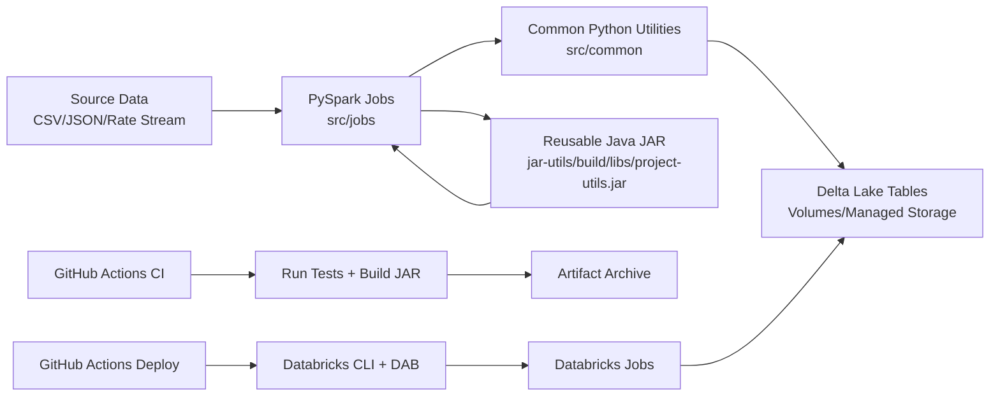

# Spark Databricks Utility Hub

Production-ready PySpark + Databricks project with a reusable Java utility JAR, CI/CD pipelines, and Databricks Asset Bundles (DAB) for environment-aware deployment.

## Project Overview

This repository combines:

- **PySpark data jobs** for batch and streaming pipelines.
- **Reusable Java utility framework** packaged as `project-utils.jar` for shared logic across many use cases.
- **Databricks Asset Bundles** for repeatable deployment to `dev` and `prod`.
- **GitHub Actions CI/CD** for test/build/deploy automation.

The codebase is prepared for multiple future workloads, including:

- Crypto market analysis
- Generic ETL pipelines
- Data quality validation
- Batch + streaming jobs
- Reusable transformation libraries
- Delta Lake helper patterns
- Logging and monitoring extensions

## Architecture



## Repository Layout

```text
.
├── .github/workflows
├── bundle
│   ├── resources
│   ├── dev.yml
│   └── prod.yml
├── jar-utils
│   └── src/main/java/com/company/utils
├── src
│   ├── common
│   ├── configs
│   └── jobs
└── tests
```

## Prerequisites

- Python `3.11`
- Java `11+` (for Gradle/JAR build)
- Databricks CLI `v0.205+` (installed automatically in CI)
- Access to a Databricks workspace and token

## Local Setup

### 1) Clone and enter the project

```bash
git clone <your-repo-url>
cd spark-databricks-utility-hub
```

### 2) Create and activate a virtual environment

```bash
python3.11 -m venv .venv
source .venv/bin/activate
```

### 3) Install dependencies

```bash
pip install --upgrade pip
pip install -r requirements.txt
```

## Build the Reusable JAR

```bash
cd jar-utils
./gradlew clean build
cd ..
```

Output JAR:

```text
jar-utils/build/libs/project-utils.jar
```

Deployment uploads this artifact to:

```text
dbfs:/tmp/project-utils.jar
```

If you prefer a Unity Catalog Volume path, set GitHub secret `DATABRICKS_JAR_URI` (for example, `dbfs:/Volumes/<catalog>/<schema>/<volume>/project-utils.jar`).

## Run Tests

```bash
pytest -q
```

## Configure Databricks Authentication

Create a Personal Access Token (PAT) in Databricks, then export:

```bash
export DATABRICKS_HOST=https://<your-workspace-host>
export DATABRICKS_TOKEN=<your-personal-access-token>
```

For GitHub Actions secrets, set `DATABRICKS_HOST` to the real workspace URL (for example, `https://adb-<id>.<region>.databricks.com`), not a placeholder like `${env.DATABRICKS_HOST}`.
Do not rely on the legacy pip package `databricks-cli` for bundle workflows; use the official Databricks CLI installer/action.

Optional (if using an existing cluster):

```bash
export DATABRICKS_CLUSTER_ID=<existing-cluster-id>
```

## Deploy with Databricks Asset Bundles

Validate, deploy, and run:

```bash
databricks bundle validate
databricks bundle deploy -t dev
databricks bundle run crypto_market_analysis_job -t dev
```

## CI/CD

- **CI (`.github/workflows/ci.yml`)**
  - Installs Python + Java
  - Runs static quality gates (`ruff`, `mypy`)
  - Runs pytest
  - Builds reusable JAR
  - Publishes artifacts

- **Deploy (`.github/workflows/deploy.yml`)**
  - Triggers on push to `main`
  - Authenticates with Databricks via `DATABRICKS_HOST` and `DATABRICKS_TOKEN`
  - Builds JAR
  - Deploys DAB assets
  - Uploads JAR to DBFS
  - Triggers Databricks job

## Optional Serverless Preset

If your Databricks workspace supports serverless jobs, start from:

`bundle/templates/serverless_jobs.yml`

This template is intentionally kept out of the active bundle includes so default deployments stay cluster-compatible.

## Notes for Production Hardening

- Extend secrets management with OIDC and Databricks service principals.
- Add contract/integration tests with sample Delta tables.
- Attach observability sinks (logs, metrics, alerts) in `src/common/logger.py`.
- Add quality gates (coverage threshold, static checks, dependency scans).
